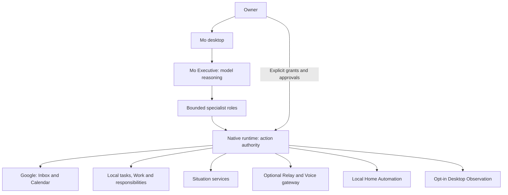

# MoMo AI

**Community Preview 0.1 · Windows x64 · local release candidate**

**Publication blocked:** native startup network observation and bundled-runtime redistribution review are unfinished. This is a local review candidate, not an approved public release.

MoMo AI is a Windows-first personal AI operating environment. Models reason and propose work; native code owns credentials, permissions, tools and action authority.

## Why MoMo?

One owner-facing Mo Executive coordinates bounded specialist roles across conversations, Work, responsibilities, Inbox, Planner, Situation and optional integrations. Models cannot grant themselves permissions. Native policy validates proposed actions against explicit grants, approval state, request budgets and cancellation. Consequential actions require owner approval.

The desktop includes proactive work, remote Relay/Voice and local Home Automation source. These capabilities require deliberate setup and retain their existing authority boundaries. This is the genuine technical project, with private development history and user data excluded.



## Developer quick start

Requirements: Windows x64, Node.js 24 or newer, npm, Python for native npm modules, Visual Studio C++ Build Tools, and Windows SDK. The project helpers currently target **MSVC v142 and Windows SDK 10.0.19041.0**. Native npm dependencies may require a newer toolchain for the selected Node/Electron release. See [release validation](PUBLIC_RELEASE_GATE.md) for the current verified state; do not assume this candidate is ready to distribute.

From a checkout of this repository:

```powershell
npm ci
npm run setup:dependencies
npm run typecheck
npm run lint
npm test
npm run security:scan
npm run dev
```

Open Settings and configure your own provider. No provider key, Google account, location, device, conversation or schedule is supplied. Credentials normally enter through Settings; `.env.example` documents configuration names and is not loaded automatically by the desktop.

```powershell
npm run build
npm run package:win:dir
```

Dependency lifecycle scripts are disabled by `.npmrc`; `setup:dependencies` runs only the reviewed Electron/esbuild binary installers. SQLite 13 supplies a Node-API prebuild used by Node and Electron. The preview uses `%APPDATA%\MoMo-community-preview` (development: `MoMo-community-preview-development`) and does not migrate an existing MoMo profile.

## Read more


- [Architecture](docs/ARCHITECTURE.md) and [security model](docs/SECURITY_MODEL.md)
- [Provider and optional integration setup](docs/PROVIDER_SETUP.md)
- [Feature status and limitations](docs/FEATURE_STATUS.md)
- [Contributing](CONTRIBUTING.md), [roadmap](docs/ROADMAP.md), and [security reporting](SECURITY.md)
- [Third-party notices](THIRD_PARTY_NOTICES.md) and [asset provenance](docs/ASSETS.md)

MoMo is an independent project. Provider compatibility does not imply affiliation, sponsorship or endorsement. Third-party names and trademarks belong to their respective owners.

Source and confirmed project-owned artwork are [MIT licensed](LICENSE). Third-party dependencies and fonts retain their own licenses. Internal application version `0.7.1` is retained; the proposed public release tag is `community-preview-0.1`.
